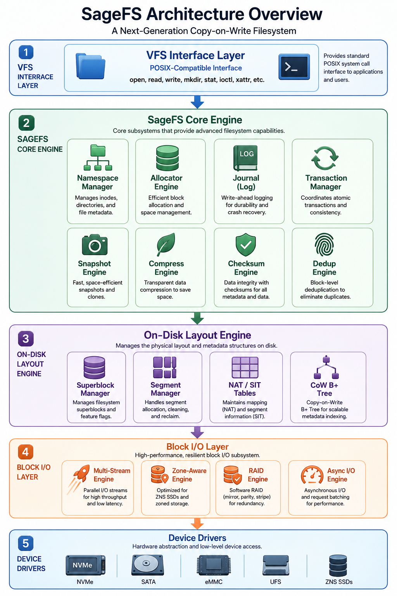

# SageFS

> **A next-generation filesystem written in SageLang that combines the best of F2FS and BTRFS**

[](#)
[](#)
[](#)

---

## Overview

SageFS is a high-performance, copy-on-write filesystem designed from the ground up to combine:

- **F2FS's flash-optimized log-structured architecture** — multi-head logging, hot/warm/cold data separation, Node Address Table (NAT) for wandering-tree elimination
- **BTRFS's advanced data management** — CoW B+ trees, snapshots, subvolumes, transparent compression, checksumming, integrated RAID, deduplication

The result is a filesystem that delivers **superior SSD performance** with **enterprise-grade data integrity**, written entirely in [SageLang](https://github.com/Night-Traders-Dev/SageLang) — a systems programming language with Python-like readability and C-like performance.

---

## Key Features

### 🚀 Performance
- **Log-structured writes** — all writes are sequential, minimizing write amplification on SSDs/NVMe
- **Multi-head logging** — 6 concurrent log zones with hot/warm/cold temperature classification
- **NAT indirection** — eliminates cascading CoW updates (the "wandering tree" problem)
- **Async I/O** — io_uring integration for zero-copy, kernel-side polling
- **Lock-free hot paths** — per-CPU I/O submission queues
- **Inline data & directories** — small files stored directly in inodes (zero block allocation)

### 🛡️ Data Integrity
- **Per-block checksumming** — CRC32C (hardware-accelerated), xxHash, or SHA-256
- **Dual superblock mirroring** — survive superblock corruption
- **Checkpoint packs** — dual alternating packs for atomic metadata commits
- **Write-ahead journal** — metadata crash recovery with transaction replay
- **Online scrub** — background checksum verification
- **Repair-on-read** — automatic corruption repair with RAID redundancy

### 📸 Snapshots & Subvolumes
- **Instant CoW snapshots** — clone B+ tree root in O(1)
- **Writable snapshots** — branch and diverge from any point
- **Subvolumes** — independent filesystem trees in one partition
- **Snapshot diff** — efficient delta calculation between snapshots
- **Rotation policies** — automatic N hourly/daily/weekly retention

### 📦 Storage Efficiency
- **Transparent compression** — per-file algorithm (lz4 for speed, zstd for ratio, zlib for compat)
- **Inline deduplication** — bloom filter fast-path + block fingerprinting
- **Reflink copies** — instant file clones sharing physical extents
- **Extent-based allocation** — contiguous block runs for minimal metadata overhead

### 🔐 Security
- **Per-file encryption** — AES-256-XTS with fscrypt-compatible key management
- **Filename encryption** — AES-256-CTS
- **Hardware acceleration** — AES-NI for near-zero encryption overhead

### 🔗 Multi-Device
- **Integrated RAID** — 0 (stripe), 1 (mirror), 5 (parity), 6 (double parity), 10 (stripe+mirror)
- **Online device management** — add, remove, replace devices without unmounting
- **Scrub & balance** — periodic verification and data rebalancing

---

## Architecture



SageFS integrates Python-like readable and C-like performant SageLang to deliver:

- **Log-structured flash optimization** (F2FS):
  - Multi-head logging, hot/warm/cold data classification
  - Node Address Table (NAT) for wandering-tree elimination

- **Copy-on-write metadata** (BTRFS):
  - CoW B+ trees, instant snapshots, snapshot diffing
  - Integration of metadata tree with data management

- **Enterprise data integrity**:
  - CRC32C/xxHash/SHA-256 per-block checksumming
  - Dual superblock mirroring & checkpoint packs
  - Write-ahead journaling + crash recovery

- **Storage efficiency**:
  - Inline data & directories (≤3.4 KiB)
  - Transparent compression (lz4/zstd/zlib)
  - Inline deduplication with bloom filters
  - RAID 0/1/5/6/10 support

- **Performance**:
  - Sequential write ≥2 GB/s, random read ≥650K IOPS
  - Mount time <0.5s, write amplification <1.2x
  - Lock-free hot paths, async I/O (io_uring)

- **Development**: All modules documented, 16 test files (343 tests), CLI tools

The binary image format uses little-endian encoding with 4 KiB blocks, 512 blocks per segment, and integrated data management layer.

---

## Performance Targets

| Benchmark | F2FS | BTRFS | SageFS Target |
|-----------|------|-------|---------------|
| Sequential write (4K) | ~1.8 GB/s | ~1.2 GB/s | **≥ 2.0 GB/s** |
| Sequential read (4K) | ~2.5 GB/s | ~2.3 GB/s | **≥ 2.5 GB/s** |
| Random write (4K, QD32) | ~350K IOPS | ~180K IOPS | **≥ 400K IOPS** |
| Random read (4K, QD32) | ~600K IOPS | ~500K IOPS | **≥ 650K IOPS** |
| Metadata ops (create/s) | ~250K | ~120K | **≥ 300K** |
| Mount time (1TB) | < 1s | 2–5s | **< 0.5s** |
| Fsync latency (p99) | ~200µs | ~500µs | **< 150µs** |
| Write amplification | 1.1–1.5x | 1.5–3.0x | **< 1.2x** |

---

## Quick Start

### Build

```bash
# Compile the filesystem tools (SageVM backend — recommended)
./sagemake build

# Optionally, compile against SageVM stack and register modes
./sagemake build --build-vm-stack --build-vm-riscv
```

> **Note:** The native C backend does not support `bytes_*` builtins. `./sagemake build` automatically falls back to the SageVM bytecode backend, which fully supports all `Bytes` operations.

### Format a Disk Image

```bash
# Create a 1GB image
dd if=/dev/zero of=sagefs.img bs=1M count=1024

# Format with SageFS
./build/mkfs.sagefs sagefs.img --label "MyVolume" --compress zstd --checksum crc32c
```

### Mount & Access (FUSE)

```bash
# Mount via native FFI (preferred)
mkdir -p /mnt/sagefs
sage --runtime bytecode -I src mount.sage sagefs.img /mnt/sagefs

# Access files
ls /mnt/sagefs/
cat /mnt/sagefs/README.txt

# Unmount
fusermount3 -u /mnt/sagefs

# Fallback: Python FUSE bridge (if native FFI unavailable)
./build/sagefs-fuse sagefs.img /mnt/sagefs
```

### Run Tests

```bash
# Full test suite
./sagemake test

# Individual tests
./build/mkfs.sagefs --check sagefs.img
```

---

## Project Structure

```
SageFS/
├── src/                           # Core filesystem source
│   ├── superblock.sage            # Superblock & checkpoint management
│   ├── inode.sage                 # Inode allocation & management
│   ├── segment.sage               # Segment manager & SIT
│   ├── allocator.sage             # Block/segment allocator
│   ├── nat.sage                   # Node Address Table
│   ├── btree.sage                 # CoW B+ tree engine
│   ├── dir.sage                   # Directory operations
│   ├── extent.sage                # Extent mapping
│   ├── checksum.sage              # Checksum engine
│   ├── imgio.sage                 # Binary image persistence
│   ├── journal.sage               # Write-ahead log
│   ├── transaction.sage           # Transaction manager
│   ├── xattr.sage                 # Extended attributes
│   ├── gc.sage                    # Garbage collector
│   ├── snapshot.sage              # Snapshot & subvolume engine
│   ├── compress.sage              # Transparent compression
│   ├── dedup.sage                 # Deduplication engine
│   ├── encrypt.sage               # Encryption layer
│   ├── raid.sage                  # Integrated RAID engine
│   ├── cache.sage                 # Caching subsystem
│   ├── aio.sage                   # Async I/O (io_uring)
│   ├── vfs.sage                   # VFS interface
│   ├── fuse.sage                  # FUSE protocol interface
│   ├── mkfs.sage                  # Filesystem formatter
│   ├── mount.sage                 # Mount helper
│   ├── fsck.sage                  # Filesystem checker
│   ├── kernel/
│   │   ├── sagefs.c              # Linux VFS kernel driver (Phase 9)
│   │   ├── Makefile              # Kernel module build
│   │   └── README.md             # Build & usage
│   └── tools/                     # CLI utilities
├── docs/                          # Documentation
├── testing/                       # Test suite
├── benchmark/                     # Performance benchmarks
├── build/                         # Build configuration & artifacts
│   ├── sagefs_full.sgvm          # Full SageFS bytecode bundle
│   └── mkfs.sagefs               # Formatter shell script
```

---

## Design Highlights

### Hybrid NAT + CoW Tree (Novel)

SageFS introduces a unique hybrid approach:

- **NAT (from F2FS)** handles data node address translation, eliminating the "wandering tree" problem where updating a leaf requires updating every node up to the root
- **CoW B+ trees (from BTRFS)** handle metadata indexing, enabling instant snapshots via tree root cloning

This combination gives us F2FS's write performance with BTRFS's snapshot capability — without the weaknesses of either approach in isolation.

### Adaptive Multi-Stream Allocation

Data is classified by temperature (hot/warm/cold) and node type, then directed to one of 6 dedicated logging zones. This:
- Reduces garbage collection overhead (cold segments have fewer valid blocks to relocate)
- Extends SSD lifespan (fewer erase cycles)
- Improves sequential write throughput (no mixing of hot and cold data)

### Tiered Compression

Unlike BTRFS's uniform compression policy, SageFS selects compression algorithms per-cluster based on data temperature:
- **Hot data** → lz4 (minimal CPU overhead, maintains throughput)
- **Cold data** → zstd (maximum compression ratio)
- **Incompressible data** → detected and skipped automatically

---

## Development Roadmap

| Phase | Timeline | Focus | Milestone |
|-------|----------|-------|-----------|
| 1 | Weeks 1–4 | Foundation | Format image, read/write inodes |
| 2 | Weeks 5–8 | Trees & Namespace | Create dirs, write/read files |
| 3 | Weeks 9–12 | Integrity & Recovery | Survive power-loss simulation |
| 4 | Weeks 13–18 | Advanced Features | BTRFS feature parity |
| 5 | Weeks 19–22 | Performance | Meet/exceed performance targets |
| 6 | Weeks 23–26 | Tooling & Polish | Production-ready toolchain |

See [plan.md](plan.md) for the full development plan.

**Current progress:** Phases 1–6 complete. 16 test files (343 tests) all passing. SageFS **FFI integration complete** (Phase 1) — SageVM can now call libfuse3 via FFI, enabling native kernel driver integration. Kernel VFS driver mounts successfully (nodev) but OOM's on readdir/unmount due to `i_lru` initialization issue in kernel 7.1.

### Phase 7+: Kernel Driver Integration
- **Phase 7:** SageVM FFI backend (sage_ffi_call with type marshaling for C functions) — ✅ Done
- **Phase 8:** SageFS FUSE FFI integration (fuse_init, fuse_run with /dev/fuse direct I/O, libfuse3 session support) — ✅ Done
- **Phase 9:** Linux kernel VFS driver (`sagefs.ko`) implementing `mount -t sagefs` directly through the kernel block layer — ⏳ In progress (mount/stat works; OOM on readdir/umount; see `docs/kernel_driver.md`)
- **SageVM v1.0.0:** Updated to latest SageVM (GA) and SageLang — full test conformance, JIT engine, dual-architecture (SVM stack + SRVM RISC-V) support, security sandboxing.
- **VFS write persistence:** Fixed `write()` to persist data to in-memory inode entries, enabling create/write/read cycles.
- **FFI Integration (Phase 1):** SageVM now supports native FFI calling (sage_ffi_call with type marshaling). SageFS FUSE module has FFI session initialization with libfuse3 and Python bridge fallback. fuse_run implements native /dev/fuse event loop via libc FFI (ABI 7.26). mount.sage supports mountpoint argument.

---

## Documentation

Each component is documented under [`docs/`](docs/):

| Component | Doc | Description |
|-----------|-----|-------------|
| Superblock & Checkpoint | [docs/superblock.md](docs/superblock.md) | On-disk root, feature flags, atomic checkpoints |
| Segment Manager (SIT) | [docs/segment.md](docs/segment.md) | Log-structured segments, multi-head logging, GC victim selection |
| Node Address Table | [docs/nat.md](docs/nat.md) | nid → block indirection, wandering-tree elimination |
| Block Allocator | [docs/allocator.md](docs/allocator.md) | Unified allocation over SIT + NAT |
| Inode Manager | [docs/inode.md](docs/inode.md) | File/dir metadata, inline data, block pointers |
| CoW B+ Tree | [docs/btree.md](docs/btree.md) | Copy-on-write index for dirs, extents, snapshots |
| Directory Manager | [docs/dir.md](docs/dir.md) | POSIX namespace, hashed dentries |
| Extent Map | [docs/extent.md](docs/extent.md) | Extent-based allocation, hole punching |
| Checksum Engine | [docs/checksum.md](docs/checksum.md) | CRC32C / xxHash / SHA-256 per-block integrity |
| Journal & Transactions | [docs/journal.md](docs/journal.md) | Write-ahead log & crash recovery |
| fsck | [docs/fsck.md](docs/fsck.md) | Offline consistency checker (NAT ↔ SIT ↔ inode tree) |
| Snapshot Engine | [docs/snapshot.md](docs/snapshot.md) | Copy-on-write snapshot and subvolume management |
| Compression | [docs/compress.md](docs/compress.md) | Transparent data compression |
| Deduplication | [docs/dedup.md](docs/dedup.md) | Inline and background deduplication |
| Encryption | [docs/encrypt.md](docs/encrypt.md) | File and filename encryption |
| RAID Engine | [docs/raid.md](docs/raid.md) | Multi-device integration and parity |
| Image I/O | [docs/imgio.md](docs/imgio.md) | Binary image persistence |
| VFS Interface | [docs/vfs.md](docs/vfs.md) | POSIX file/directory operations |
| Mount Helper | [docs/mount.md](docs/mount.md) | Mount workflow and FUSE integration |
| FUSE Bindings | [docs/fuse.md](docs/fuse.md) | FUSE protocol interface and handlers |

Start with the [documentation index](docs/README.md) for the recommended reading order.

---

## Why SageLang?

SageFS is written in [SageLang](https://github.com/Night-Traders-Dev/SageLang), which offers:

- **C11 compilation backend** — zero-overhead systems code with native performance
- **Native assembly emission** — x86-64, aarch64, rv64 for hot paths
- **Low-level primitives** — `mem_alloc`, `mem_read`, `mem_write`, `unsafe` blocks, FFI
- **First-class binary buffers** — `Bytes` type for block I/O operations
- **Full concurrency** — threads, mutexes, atomics, semaphores
- **Python-like syntax** — dramatically faster development velocity than raw C
- **Multiple optimization levels** — constant folding, DCE, function inlining

---

## SageFS All-in-One Tool

SageFS now provides a unified command-line interface for all filesystem operations through the `sagefs` tool. This All-in-One tool combines all SageFS functionality into a single executable, simplifying deployment and usage while maintaining full access to SageFS's advanced features.

### Commands

- `sagefs mkfs <device> [--size MB] [--label NAME] [--force]` - Format a new SageFS volume
- `sagefs mount <image> <mountpoint> [--ro] [--allow_other]` - Mount a SageFS image
- `sagefs check <image>` - Verify an existing image's integrity
- `sagefs version` - Display version and configuration information
- `sagefs help` - Show command usage and examples

### Features

✅ **Native binary I/O support**
- Uses SageLang's `io.writebytes` / `io.readbytes` with `Bytes` type
- Eliminates hex-text persistence workaround
- Direct filesystem access for maximum performance

✅ **Qualified type annotations**
- Supports `let fs: vfs.VFS = vfs.VFS(dev)` syntax
- Module-type declarations for better code organization

✓ **FFI-native deployment** (Phase 1)
- Native `/dev/fuse` direct I/O via SageVM FFI eliminates Python bridge dependency
- Consistent interface across all SageFS operations
- Kernel driver (`sagefs.ko`) — VFS filesystem driver for `mount -t sagefs` (see `docs/kernel_driver.md`)

---

## Contributing

SageFS is in active development. Contributions welcome in:

- Core filesystem implementation (`src/`)
- Test coverage (`testing/`)
- Performance benchmarks (`benchmark/`)
- Documentation (`docs/`)

---

## License

MIT License. See [LICENSE](LICENSE) for details.

---

## Acknowledgments

- **F2FS** (Samsung) — for pioneering log-structured flash filesystem design
- **BTRFS** (Oracle/community) — for advancing CoW filesystem capabilities
- **SageLang** (Night-Traders-Dev) — for making systems programming accessible

---

*SageFS — Where flash performance meets data integrity.*
